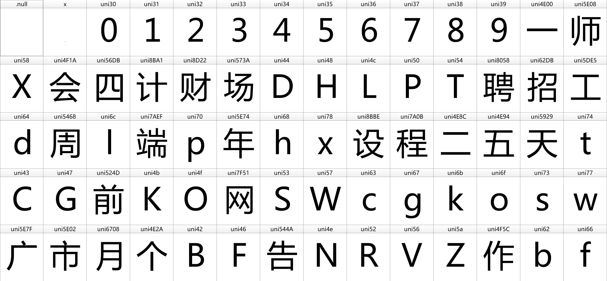

# 如何反反爬取
## 问题
将要爬取的页面保存为 HTML 后，转换为 Beautifulsoup 对象对网页元素进行爬取时，会发现网页内容与 HTML 代码中给出的不一致。  
例如：在网页上显示为 `IT行业研究员` 的字段，对其使用 `检查元素` 查找对象在 HTML 源码中的位置，发现该元素的 `title` 属性为 `&#xeaff&#xf213&#xed06业研究员`，直接对 `title` 字段进行爬取的话，数据会出现乱码。
## 分析
经合理猜测，网页前端代码采取了使用 `自定义字体` 的方法来反爬虫。在格式 `&#XXXXX` 自定义字体中，字体以 `&#` 作为序列起始，后五位 `XXXXX` 为对应的字体编号。
## 解决
加密字体与实际字体一定是一一对应的，所以要先找出网页所使用的自定义字典。在查看网页 HTML 源码后，可以找到在 `head` 标签下，有属性为 `data-n-head="ssr"` 的 `style`标签，内容为：
```html
@font-face {    font-family: myFont;    src: url(/interns/iconfonts/file?rand=0.9593768089506858);}
```
`font-family` 字段的属性 `myFont` 显然表示了网页采取了自定义字体，`src: irl` 指向了自定义字体的路径，但他是一个相对路径，通过与网站 `host` 地址的拼接，我们可以得到自定义字体的绝对路径：
```html
https://www.shixiseng.com/interns/iconfonts/file?rand=0.9593768089506858
```
访问链接可以得到文件名为 `file` 的文件，猜测其后缀为 `woff2` 的字体文件，将其重命名为 `file.woff2`，再用字体编辑器打开，如图：



用 `Python` 将其转换为 xml 文件方便修改编辑：
```Python
def font_dict(): 
    font = TTFont('file.woff2')
    font.saveXML('shixi.xml') 
```
在 xml 文件的 `map` 字段可以发现如下代码：
```xml
<map code="0xe085" name="uni31"/><!-- ???? -->
```
不难看出，每一个加密字体都是一一对应的。接下来就是获取这种对应关系，`code` 所示的就是网页上的源码形式，但是用 `getBestCmap()` 函数获取后又变成十进制的数了，所以需要用 `hex()` 函数将10进制整数转换成 16 进制，以字符串形式表示成原来的形式。

```Python
def font_dict():
    font = TTFont('shixi.ttf')
    font.saveXML('shixi.xml')
    ccmap = font['cmap'].getBestCmap()
    print("ccmap:\n",ccmap)
    newmap = {}
    for key,value in ccmap.items():
        # value = int(re.search(r'(\d+)', ccmap[key]).group(1)) - 1
        #转换成十六进制
        key = hex(key)
        value = value.replace('uni','')
        a = 'u'+'0' * (4-len(value))+value
        newmap[key] = a
    print("newmap:\n",newmap)
    #删除第一个没用的元素
    newmap.pop('0x78')
    #加上前缀u变成unicode....
    for i,j in newmap.items():
        newmap[i] = eval("u" + "\'\\" + j + "\'")
    print("newmap:\n",newmap)

    new_dict = {}
    #根据网页上显示的字符样式改变键值对的显示
    for key, value in newmap.items():
        key_ = key.replace('0x', '&#x')
        new_dict[key_] = value

    return new_dict
```
这样就能构造出一个自定义字体的解密字典了。接下来需要对爬取的数据进行解密：
```Python
def decrypt_text(text, new_dict):  # 根据反反爬字典将加密文本替换正确文本
    for key, value in new_dict.items():
        if key in text:
            text = text.replace(key, value)
        else:
            pass
    return text
```
传入的 `text` 为网页的 `html` 源码，`new_dict` 为解密字典。这样就能从网站上爬取到正确的数据了。